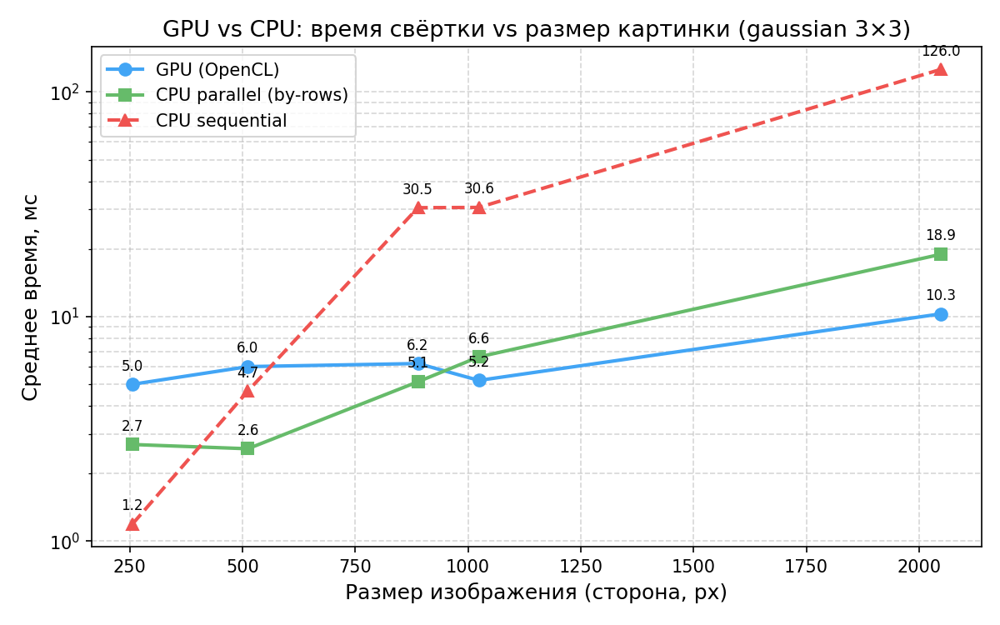
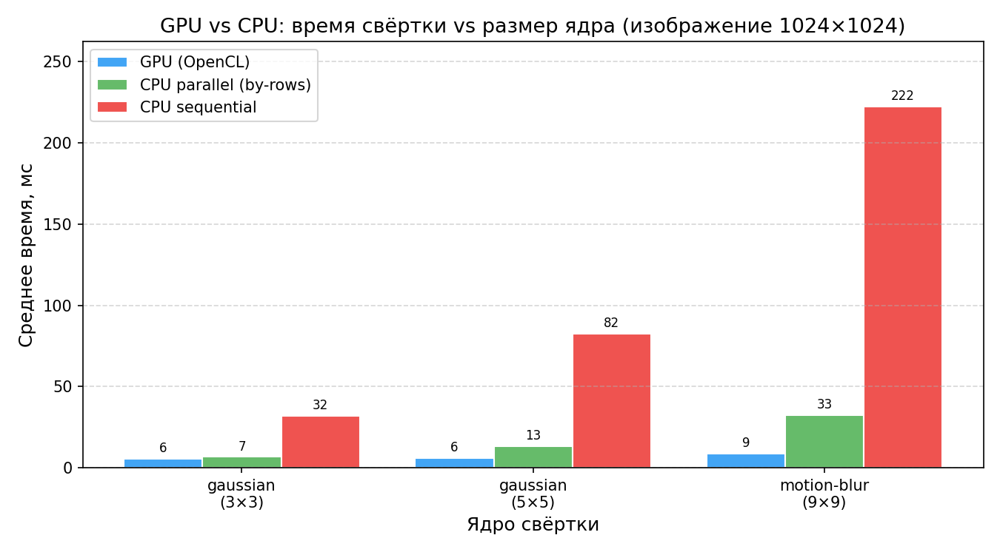

# Задача 4 — GPU-свёртка через OpenCL

GPU-свёртка одного изображения через OpenCL (JOCL). Каждый пиксель результата считает отдельный work-item на GPU. Реализация — [`core/.../GpuConvolution.kt`](../core/src/main/kotlin/workshop/parallels/core/GpuConvolution.kt), ядро на OpenCL C — [`core/.../convolution.cl`](../core/src/main/resources/convolution.cl).

## Архитектура

| Часть         | Где                                | Назначение                                            |
| ------------- | ---------------------------------- | ----------------------------------------------------- |
| хост-код      | `GpuConvolution.kt` (Kotlin)       | инициализация OpenCL, копирование данных, запуск ядра |
| ядро          | `convolution.cl` (OpenCL C)        | свёртка одного пикселя, запускается параллельно       |
| биндинги      | JOCL 2.0.6 (`org.jocl:jocl`)       | JNI-обёртка над нативным OpenCL                       |

Каждый вызов `convolveGpu(image, kernel)`:

1. Находит OpenCL-платформу и устройство (`clGetPlatformIDs` / `clGetDeviceIDs`).
2. Создаёт контекст и очередь команд.
3. Компилирует `.cl` под текущее устройство (`clBuildProgram`).
4. Копирует `image.pixels` и `kernel.data` в GPU-буферы.
5. Запускает ядро на двумерной сетке `width × height` — по одному work-item на пиксель.
6. Копирует результат обратно в `IntArray`, освобождает GPU-ресурсы.

Контекст и программа создаются заново на каждый вызов. Это намеренно простая реализация обязательной части ТЗ 4.1; переиспользование контекста — оптимизация для опциональной части 4.3.

## Соответствие CPU-версии

Ядро повторяет `convolve()` из задачи 1:

```c
result(x, y) = clamp(factor * Σ image(x+kx, y+ky) * kernel(kx, ky) + bias, 0, 255)
```

Обработка границ — только CLAMP (зашита в `.cl`). Property-based тесты (`GpuConvolutionTest`) проверяют побитовое совпадение с CPU-версией на случайных картинках для трёх ядер (identity, gaussian, sharpen) — 1000 итераций каждое.

## Окружение для запуска

GPU-код проверен на двух конфигурациях:

- **WSL2 (Ubuntu 24.04) + Intel Arc 130T:** `clBuildProgram` падает с SIGSEGV в `libigc.so.1` (Intel Graphics Compiler) даже на минимальном `.cl` ядре. Тесты и бенчмарки в WSL не запускаются.
- **Windows 11 + Intel Arc 130T:** все тесты проходят, бенчмарки прогоняются полностью.

## Запуск CLI

```bash
make task4 ARGS="-i samples/img4.jpg -o out/task4.png -k gaussian"
make task4 ARGS="-k motion-blur"
```

## Бенчмарки

JMH 1.37, JDK 21, 1 fork, 3 warmup + 5 measurement iterations по 10 с каждая. CPU — Intel Core Ultra 5 225H. GPU — Intel Arc 130T (встроенная).

```bash
make bench TASK=4   # запуск только на Windows
make plots TASK=4   # графики в docs/plots/
```

**График 1** — GPU vs CPU vs параллельный CPU по размеру картинки (gaussian 3×3, log-шкала по Y):



**График 2** — GPU vs CPU vs параллельный CPU по размеру ядра (img4 1024×1024):



## Анализ

### График 1

Время свёртки gaussian 3×3 при разных размерах картинки (мс):

| Размер     | GPU  | CPU parallel | CPU sequential |
| ---------- | ---- | ------------ | -------------- |
| 256×256    | 5.0  | 2.7          | 1.2            |
| 512×512    | 6.0  | 2.6          | 4.7            |
| 889×889    | 6.2  | 5.1          | 30.5           |
| 1024×1024  | 5.2  | 6.6          | 30.6           |
| 2048×2048  | 10.3 | 18.9         | 126.0          |

CPU sequential растёт примерно как квадрат стороны картинки. CPU parallel остаётся ниже sequential на всех размерах: ускорение растёт от ×0.4 (256, parallel медленнее) до ×6.7 (2048).

GPU держится в диапазоне 5–6 мс на размерах до 1024×1024 и поднимается до 10 мс на 2048×2048. На 256×256 GPU медленнее обоих CPU-вариантов, на 2048×2048 — быстрее CPU parallel в 1.8 раза и быстрее CPU sequential в 12 раз. Точка, после которой GPU обгоняет CPU sequential, находится между 512 и 889 пикселей по стороне.

### График 2

Время свёртки на 1024×1024 при разных размерах ядра (мс):

| Ядро              | GPU | CPU parallel | CPU sequential |
| ----------------- | --- | ------------ | -------------- |
| gaussian 3×3      | 6   | 7            | 32             |
| gaussian 5×5      | 6   | 13           | 82             |
| motion-blur 9×9   | 9   | 33           | 222            |

CPU sequential растёт примерно как квадрат стороны ядра: 3²=9, 5²=25, 9²=81 операций на пиксель → 32 / 82 / 222 мс (×2.56, ×2.71). CPU parallel демонстрирует тот же характер роста с базы в ~5 раз меньше: 7 / 13 / 33 мс (×1.86, ×2.54).

GPU: 6 / 6 / 9 мс — рост существенно меньше, чем у CPU. Относительное ускорение GPU vs CPU sequential: 3×3 — ×5.3, 5×5 — ×13.7, 9×9 — ×24.7.

### Корректность

`convolveGpu` побитово совпадает с `convolve()` для трёх ядер (identity, gaussian, sharpen) на 1000 случайных картинках в `GpuConvolutionTest`.

### Ограничения текущей реализации

1. OpenCL-контекст создаётся на каждый вызов — оптимизация (опциональная часть 4.3) не сделана.
2. Граница — только CLAMP.
3. Тип данных в `.cl` — `float`, в CPU-версии — `double`. На пройденных тестах разницы нет.
4. Опциональные части ТЗ 4.2 (гибрид GPU+CPU) и 4.4 (несколько свёрток одновременно) не реализованы.
